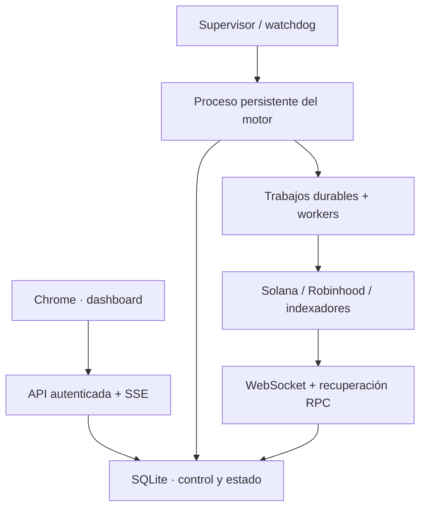

# Arquitectura persistente

El navegador no decide cuándo escanear ni cuándo operar. La API sirve estado/control; un proceso separado mantiene WebSockets, scheduler y workers. `runtime/supervisor.mjs` vigila heartbeat y tiempos de trabajos. Docker puede reiniciar el servicio completo. SQLite WAL guarda control/cola/datasets/contabilidad; un lease impide dos motores activos sobre la misma database.

## Componentes

| Archivo / módulo | Responsabilidad |
|---|---|
| runtime/server.mjs | API autenticada, SSE durable, estáticos, controles prioritarios y supervisor. |
| runtime/engine.mjs | Lease, recuperación, heartbeat, scheduler, ejecución de trabajos/reintentos y retención. |
| runtime/network-streams.mjs | WSS, ACK de suscripciones, estado parcial, reconnect, ping y slots/bloques. Respeta proxy de salida si existe. |
| core/engine-state.mjs | Eventos, cola SQL, control durable, pausa de entradas, recuperación y estado. |
| core/pool-discovery.mjs | Instrucciones exactas PumpSwap/Raydium CPMM; receipts PairCreated Robinhood. |
| core/watchers.mjs | Head/cursor separado del historial manual, ingestión idempotente, contexto y aprendizaje descriptivo. |
| core/scanner.mjs | Mercado real, tokens rotativos, señales explicables, entradas PAPER/SHADOW/LIVE APPROVAL. |
| core/position-monitor.mjs | Trabajo separado para salidas PAPER y refresco de activos de órdenes pendientes aun con motor parado. |
| core/paper-ledger.mjs | Cash, posición y orden virtual atómicos; epoch/pausa/límite diario/max posiciones en la transacción. |
| core/execution/ | Construcción, simulación, aprobación/firma, envío único y reconciliación real. |
| app/live-dashboard.tsx | Estado, decisiones, mercado, trades, posiciones, traders y salud desde SSE. |
| app/remote-engine.ts | Puente autenticado opcional desde el alojamiento al backend HTTPS central. |

## Jobs y recuperación

Concurrencia por defecto 3. Reconciliación y salidas tienen prioridad; no dependen de terminar un scanner grande. Scanner acotado por tiempo; salidas procesan dos posiciones y avanzan cursor incluso si falla el proveedor. Así una posición con error no impide llegar a las siguientes.

Los eventos de wallet/pool se guardan como jobs antes de avanzar checkpoints. Ingestión reintenta con espera exponencial acotada hasta 5 min, sin descartar tras cuatro fallos. El estado/error queda visible. Backfill Solana al reconectar usa la última firma de logs recibida por programa y páginas de firmas; la primera conexión comienza en presente. Wallets tienen head y paginación propios; Robinhood recupera PairCreated desde un cursor de bloques con dos confirmaciones. Todo depende del historial del proveedor y de poder vaciar la cola.

Caída del motor: expira lease, watchdog reinicia, reencola RUNNING y recupera saldo/posiciones/sesiones. Incrementa epoch y cancela estados anteriores a broadcast. Conserva transacciones ya comprometidas, incluidas las inciertas, para reconciliar la misma firma. LIVE recupera con entradas pausadas. STOP conserva posiciones pero no ejecuta salidas nuevas; PAUSE sí sigue vigilándolas.

SSE reenvía eventos persistidos después de Last-Event-ID y snapshots actuales cada dos segundos. Reconectar no ejecuta un trade ni inicia otro motor. La retención puede impedir replay de eventos muy antiguos; el snapshot actual permite reconstruir la pantalla.

## Dinero y órdenes

CREATED → QUOTED → BUILT → SIMULATED → AWAITING_APPROVAL → APPROVED → SIGNED → BROADCAST_PENDING → SUBMITTED/SUBMISSION_UNKNOWN → RECONCILING → RECONCILED.

Cantidades on-chain son enteros base en texto/BigInt. Valoración USD usa precio real reciente y centavos enteros. Reserva/aprobación, firma exacta, epoch y estado se verifican antes del envío. Timeout de envío no equivale a fallo ni autoriza otra compra. Las ventas LIVE usan inventario FIFO y ledger de fees/PnL; el resultado de un envío no se considera fill hasta reconciliar transaction/receipt.

PAPER usa cotizaciones y mínimos reales con capital virtual. Los fees configurados son supuestos registrados. SHADOW simula sin firmar/enviar; no hay cartera SHADOW completa. LIVE AUTO sigue bloqueado. No se completó prueba financiada mainnet ni auditoría independiente.

## Investigación y cobertura

Cada decisión conserva razones PASS/FAIL/UNKNOWN. La falta de metadata no se sustituye por seguridad. Los contextos de traders se etiquetan PRE_TRADE, POST_TRADE_OBSERVATION o UNAVAILABLE. Flujos opuestos USDC/USDG son inferencias. Patrones son estadísticas descriptivas; no hay clasificador bot/humano calibrado ni estrategia con ventaja validada.

Precios y volumen son REST indexado, con timestamp de recepción. WS confirma actividad de cadena, pero no transforma datos indexados en ticks on-chain. No cubre todas las pools/protocolos ni todos los swaps. No hay reversión completa ante reorgs, failover distribuido o redundancia de hosts.

## Almacenamiento y seguridad

SQLite es fuente de verdad del servidor. D1 conserva la instancia alojada previa y la migración aditiva de tablas; si se conecta REMOTE_ENGINE_URL, la API utiliza el backend central sin mezclar las dos bases. No hay sincronización automática ni importador integral de sesiones anteriores.

Tokens aleatorios, cookie HttpOnly/SameSite, TLS en despliegue, rechazo cross-origin, secretos cifrados AES-GCM, RPC restringidos a hosts confiables y signers fuera de Git. El puente usa secreto solo entre servidores. No se incluyen signed payloads ni claves en exportaciones/UI. Backup consistente y claves correspondientes deben guardarse fuera del host.

Logs/snapshots no referenciados tienen retención configurable de 7 días. Contabilidad, órdenes y contexto de aprendizaje se conservan. No hay un indexador masivo ni garantía de latencia subsegundo para todo el universo.
